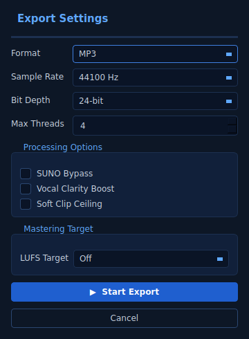

# Panha Audio Meta Data

A PyQt6 + ffmpeg desktop application for batch editing MP3 (and other audio) metadata
— cover art, title, artist, album, year, genre, comment, description, and studio fields.

The UI is inspired by the X-MIXM reference design (dark blue/cyan theme, batch queue,
File Information dialog, animated waveform).


| File Information dialog | Export Settings |
|---|---|
|  |  |

## Features

- **Batch queue** with filename, duration, type and status columns
- **Setting Console** with a 13-slider X-MIXM mastering grid (EQ, Comp/Limit/Sat,
  Verb/Echo, Width/Gain) that maps directly to ffmpeg audio filters
- **In-app preview transport** (Prev / Play / Next / BYPASS / scrubber) backed by
  `QMediaPlayer` so you can audition the currently-selected queue row before exporting
- **CPU / RAM** indicator in the status bar (1 Hz, powered by `psutil`)
- **Config** button collects every batch action — Add Files, Add Folder, Output Folder,
  File Information, Export Settings, Start / Stop — in one popup
- **Templates** persist the entire console state (metadata + tracklist + mastering)
  to `~/.panha_templates.json`; **Save As / Update / Remove / Reset all** live on the
  Setting Console template row
- **File Information dialog** with all standard ID3v2 fields:
  - Title, Artist, Album, Year, Genre, Rating, Cover art, Description, Comment
  - Studio metadata: Engineer, Copyright, Software, Source
  - Tracklist options: UPPERCASE, Remove Track Number, Cover Size
- **Cover art** embedding from a file or "folder" (first image found in folder)
- **Export Settings** dialog (format, sample rate, bit depth, threads, mastering target)
- **Context menu** (right-click queue): Select all / Add / Remove / Start / Stop / Open output
- Multi-threaded background worker (UI stays responsive)
- Right-side animated waveform footer while exporting
- 100% pure ffmpeg backend — **stream-copy by default** (zero-loss tagging) and
  **automatic re-encode** when the mastering chain is active (per-suffix codec table,
  e.g. `libmp3lame -q:a 2` for MP3, `aac -b:a 192k` for M4A, `flac` for FLAC, etc.)

## Requirements

- Python **3.10+**
- **ffmpeg** & **ffprobe** in `PATH` (or set `PANHA_FFMPEG` / `PANHA_FFPROBE`)

Install ffmpeg:

```bash
# Ubuntu / Debian
sudo apt-get install ffmpeg

# macOS
brew install ffmpeg

# Windows (Chocolatey)
choco install ffmpeg
```

## Installation

```bash
git clone https://github.com/<you>/panha-audio-metadata.git
cd panha-audio-metadata
python -m venv .venv
source .venv/bin/activate    # Windows: .venv\Scripts\activate
pip install -e .[dev]
```

## Run

```bash
python -m panha
# or
panha
```

## Usage

1. Click **Config** in the Setting Console (or right-click the queue) and choose
   **Add Files** / **Add Folder** to populate the batch queue.
2. Adjust the **mastering sliders** to taste — leave them all at zero for a pure
   tag-only export. Toggle **BYPASS** in the transport bar to disable the chain.
3. Click **File Information** from the Config dialog and fill in the metadata you
   want to inject.
   - Optionally click **...** next to *Cover* to pick a single image, or **Folder**
     to point at a directory whose first image file will be used.
4. Click **Save As** on the template row to save the current console state
   (metadata + tracklist + mastering) as a reusable preset.
5. Open the **Config** dialog again to pick **Output Folder**, tweak **Export
   Settings**, and trigger **Start Export**.
6. **Re-encode behaviour**: when every mastering slider is zero (or BYPASS is on)
   ffmpeg runs with `-c:a copy` and audio is **not re-encoded** — only the ID3v2 tag
   block and embedded artwork are rewritten. The moment any slider is non-zero the
   writer switches to a transparent re-encode using a codec appropriate for the
   destination suffix (e.g. `libmp3lame -q:a 2` for `.mp3`).

## Programmatic use

The metadata writer is decoupled from the UI and can be used standalone:

```python
from panha.mastering import MasteringSettings
from panha.metadata import Metadata, write_metadata

meta = Metadata(
    title="The Morning After",
    artist="Panha",
    album="Echoes",
    year="2026",
    genre="Lo-fi",
    cover_path="/path/to/cover.jpg",
    comment="Mastered with Panha",
)

# Tag-only (stream-copy, zero-loss).
write_metadata("input.mp3", "output.mp3", meta)

# With mastering — applies an ffmpeg filter chain and re-encodes.
mastering = MasteringSettings(bass=30, comp=20, gain=10)
write_metadata("input.mp3", "mastered.mp3", meta, mastering=mastering)
```

## Development

```bash
pip install -e .[dev]
ruff check panha tests
pytest
```

## License

MIT — see [LICENSE](LICENSE).
# panha-audio-metadata
